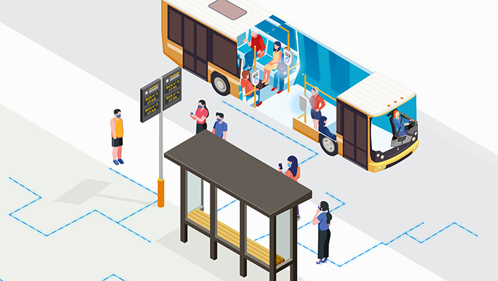

# Database Term Project

<br>
This is the term project of Level 2 term 2. 
This is a project that can support a bus management system of the cities. 
Here there is a system admin panel, company panel, user panel. 
They have different functionalities.

Author: 
- Akibur Rahman ( 
[Github](https://github.com/akib-89) | 
[LinkedIn](https://www.linkedin.com/in/akibur-rahman-919b40188/) |
[Facebook](https://www.facebook.com/profile.php?id=100010756200351))

- Zarin Tasnim Batool (
[Github](https://github.com/zarinbatool18) | 
[Facebook](https://www.facebook.com/zt.batool)
)

Functionalities of different client side:
- Admin:
  * Can create a route.
  * Can create a location.
  * Update an existing route.(change the fare from one location to another)
  * Approve a company to the system.
- Company Owner:
  * Register a company.
  * Add a bus to the system.
  * Create a schedule for the buses. (which bus will operate on which route)
  * approve bus driver for the owned bus on a given date.
- Driver:
  * Register as a bus driver.
  * request for driving a bus for next couple of days.
  * Update the location of the bus currently driving. (Now it is done using web gui. but in future this will be done by ajax function)
- User:
  * Request for a trip.
  * Rate the last trip.

Some major functionality that is implemented now is

- [Router](#router)
- [Passport Authentication](#validation)
- [Validation middlewares](#validation)
- [Controller](#controller) (Not implemented in this project)
- [Service](#service)
- [Repository](#router) (Not implemented in this project)
- [Oracle Database Connection](#database-connection)

### Router
- Router here checks if the user is authorized or not. 
- It filters all the api calls in api route and routed them accordingly. 
- The controller (business) logic is also implemented in this layer.
- This layer fetches the data from the service layer and also does the business logic in this layer.
### Validation
- Validation middleware validates and sanitized the user input to minimize security risks.
- The validation here the work of the validation middleware is done using the passport authentication.

### Controller
Not included in this project
(The work of this layer is done in the Router layer of the repository).
- The main/business logic is implemented is controller layer
- It asks for data from service layer (But for this straight from repository)

### Service
Included in this project
- Service layer implements all logic related to sql queries
- It also fetches the data itself.

### Repository
Not included in this project 
(The work of this layer is done in the service layer of the repository).
- Repository is where the query is executed and served
- Redis or Node Caching is done here (Not included in this project)
### Database Connection
In this project the database used is oracle.
- Holds all the data to function the project correctly. 

### Download

Download zip of this repository, or clone this from git cli

### Dependencies

The project runs on NodeJS environment. So at first you should download node in your machine.

## Installing

After cloning create a database user with the following permission
- create session.
- create sequence.
- create trigger.
- create table.
- unlimited tablespace.

Then configure the project as mentioned [here](#configure). Then run the scripts.

Running the scripts:

```
npm install
```

## Configure

The environment variables and other sensitive info like password are kept in an env file.
Create a `.env` file in the root folder.
Add the following variables in it

```dotenv
PORT=4420
DB_USER=YOUR_DB_USER
DB_PASS=YOUR_DB_PASSWORD
DB_CONNECT_STRING=YOUR_DB_CONNECT_STRING
```

## Executing program

Run the script
```
npm start
```
to start node monitor realtime updater for node environment.
```
npm run dev
```
To kill process type ctrl+c `^C` in terminal


## End Points:
- GET:
  * [Database Term Project](#database-term-project)
  * [Home Page](#home-page)
  * [Public Get](#public-get)
  * [Auth](#auth)
  * [Admin Get](#admin-get)
  * [Company Get](#)
  * [Driver Get](#)
  * [User Get](#admin-get)
- POST:
  * [User Post](#)
  * [Driver Post](#)
  * [Company Post](#)
  * [Admin Post](#)

### Home Page
<kbd>GET</kbd> `BASEURL`
### Public Get
<kbd>GET</kbd> `BASEURL/public` Response type: `<HTML/>`

| Query                             | Endpoint                              | Request Params   | Response Type      |
|-----------------------------------|---------------------------------------|------------------| ------------------ |
| Get fare                          | `/fare`                               | -src, des, route | `json`             |
| Get bus with id                   | `/bus/{id}`                           | -N/A             | `json`             |
| Get bus dynamic status            | `/bus/{id}/dynamic_status`            | -N/A             | `json`             |
| Get all company                   | `/company`                            | -N/A             | `json`             |
| Get all route                     | `/route`                              | -N/A             | `json`             |
| Get route by id                   | `/route/{id}`                         | -N/A             | `json`             |
| Get all location                  | `/location`                           | -N/A             | `json`             |
| Get location by id                | `/location/{id}`                      | -N/A             | `json`             |
| Get all route passing locaiton    | `/location/{location_id}/route`       | -N/A             | `json`             |
| Get all location of a route       | `/route/{route_id}/location`          | -N/A             | `json`             |
| Get all destination from locaiton | `/location/{location_id}/destination` | -N/A             | `json`             |
| Get bus in a route today          | `/route/{route_id}/bus`               | -date            | `json`             |

### Auth:
<kbd>GET</kbd> `BASEURL/auth`

### Admin Get:

### Admin Post: